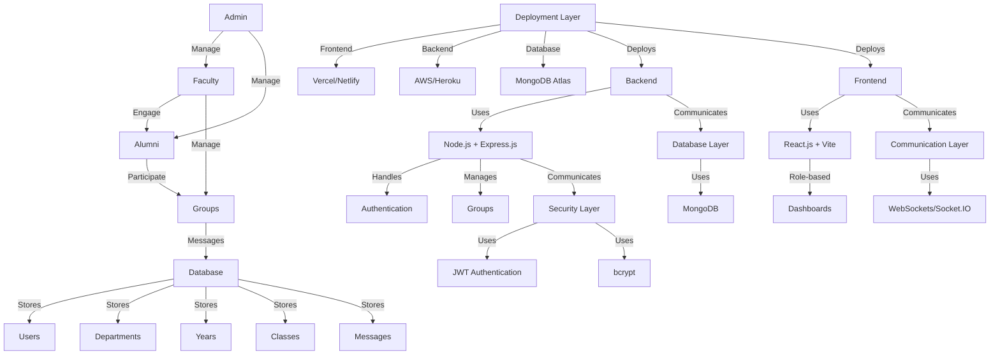

# Alumni-Faculty Engagement Platform Architecture

```mermaid
  graph TD;
      A[Admin] -->|Manage| B[Faculty];
      A -->|Manage| C[Alumni];
      B -->|Engage| C;
      B -->|Manage| D[Groups];
      C -->|Participate| D;
      D -->|Messages| E[Database];
      E -->|Stores| F[Users];
      E -->|Stores| G[Departments];
      E -->|Stores| H[Years];
      E -->|Stores| I[Classes];
      E -->|Stores| J[Messages];
      K[Frontend] -->|Uses| L[React.js + Vite];
      L -->|Role-based| M[Dashboards];
      N[Backend] -->|Uses| O[Node.js + Express.js];
      O -->|Handles| P[Authentication];
      O -->|Manages| Q[Groups];
      R[Database Layer] -->|Uses| S[MongoDB];
      T[Communication Layer] -->|Uses| U[WebSockets/Socket.IO];
      V[Security Layer] -->|Uses| W[JWT Authentication];
      V -->|Uses| X[bcrypt];
      Y[Deployment Layer] -->|Frontend| Z[Vercel/Netlify];
      Y -->|Backend| AA[AWS/Heroku];
      Y -->|Database| AB[MongoDB Atlas];
      K -->|Communicates| T;
      N -->|Communicates| R;
      O -->|Communicates| V;
      Y -->|Deploys| N;
      Y -->|Deploys| K;
```
