# Alumni-Faculty Engagement Platform Architecture

```mermaid
graph TB
    subgraph "👥 USERS"
        A[👨‍💼 Admin]
        B[👨‍🏫 Faculty] 
        C[🎓 Alumni]
    end
    
    subgraph "💻 FRONTEND"
        D[React.js + Vite<br/>📱 Role-based Dashboards]
    end
    
    subgraph "⚙️ BACKEND"
        E[Node.js + Express.js<br/>🔐 JWT Auth<br/>📡 Socket.IO]
    end
    
    subgraph "🗄️ DATABASE"
        F[MongoDB Atlas<br/>📊 Users, Groups, Messages]
    end
    
    subgraph "☁️ DEPLOYMENT"
        G[Vercel/Netlify<br/>Frontend]
        H[AWS/Heroku<br/>Backend]
        I[MongoDB Atlas<br/>Database]
    end

    A --> D
    B --> D  
    C --> D
    D -.->|API Calls| E
    E -.->|Real-time Chat| D
    E --> F
    
    G -.-> D
    H -.-> E
    I -.-> F
    
    style A fill:#ff9999
    style B fill:#99ccff  
    style C fill:#99ff99
    style E fill:#ffcc99
    style F fill:#ff99ff
```

**🔄 Data Flow:**
1. **Users** access role-based dashboards
2. **Frontend** sends requests to backend
3. **Backend** handles auth & real-time chat
4. **Database** stores all platform data
5. **Deployment** hosts each layer separately